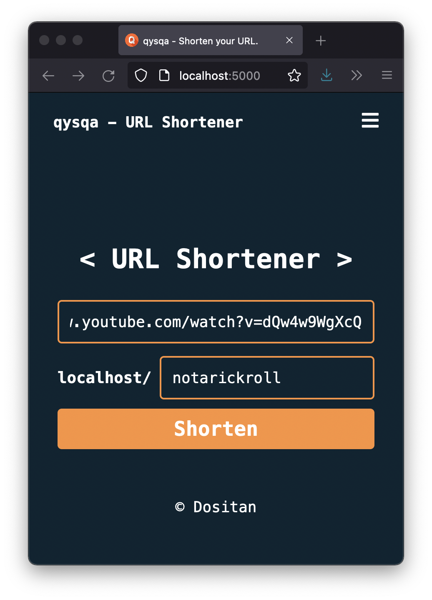

    <h1>Qysqa - shorten your URL</h1>
    
~ A simple URL-shortening website.

	 
	<strong>how do you pronounce it tho?</strong>
	
- It's "qısqa", which means "short" in Kazakh

### Why to use?
**Simplicity.** Qysqa is really easy to use and it's completely free!

---

### Run locally

Clone the repository:

	$ git clone https://github.com/Dositan/qysqa.git

CD into the directory, spawn virtual environment and install dependencies:

	$ cd qysqa
	$ poetry shell
	$ poetry install

Run app with:

	$ flask run

**NOTE:** When running locally all short URLs will also be local.

Qysqa also provides simple CLI features:

	$ flask --help
	Usage: flask [OPTIONS] COMMAND [ARGS]...

	...

	Commands:
	init-db  Clear the existing data and create new tables.
	main     Make URL manipulations directly in the terminal
	routes   Show the routes for the app.
	run      Run a development server.
	shell    Run a shell in the app context.

---

### Todo

- [ ] API:
	- [ ] Make CLI use hosted API rather than returning static localhost

- [x] Change configuration:
	- [x] the way of configuring
	- [x] configuration structure
	- [x] more flexible implementation, by probably using app/config.py and .env
	- [ ] add database credentials

- [ ] Implement auth feature
	- [ ] Ability to sort by user ID
	- [ ] User statistics

- [ ] Better CLI
	- [ ] Ability to use other shorteners

- [x] Deploy to Heroku
